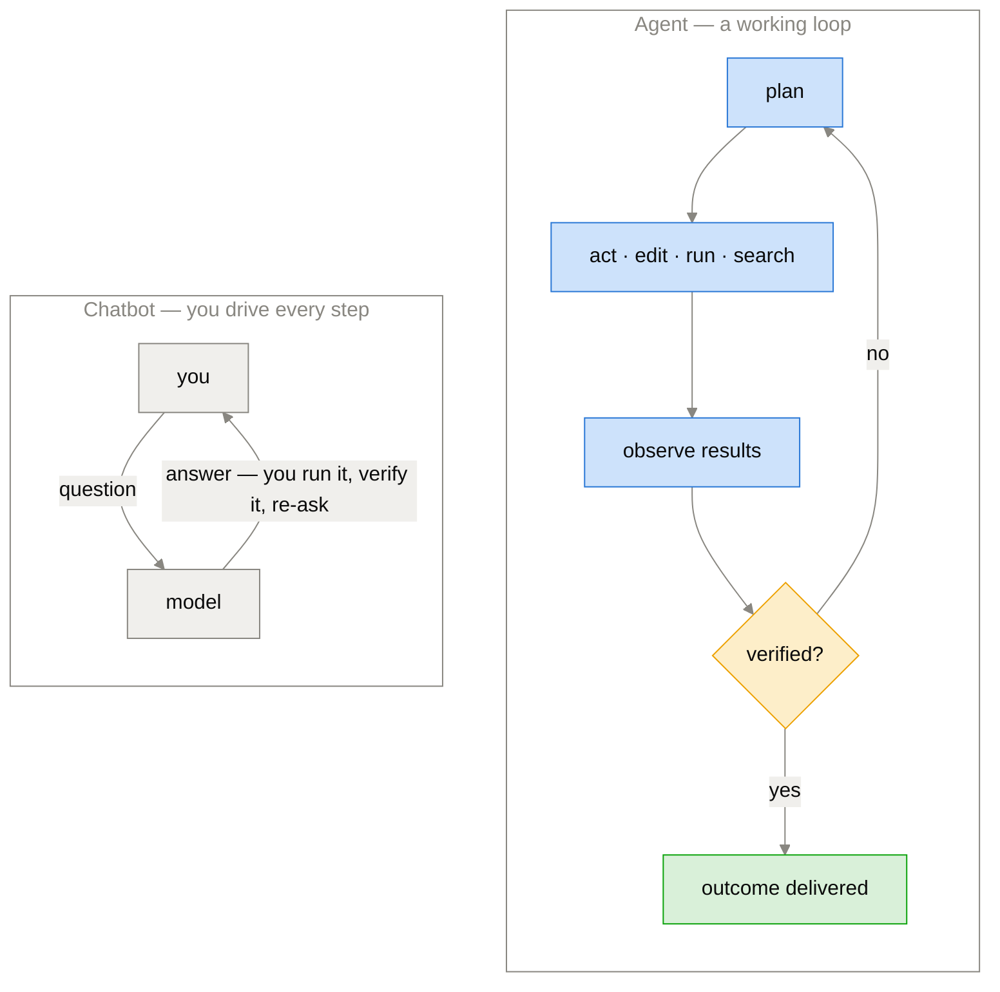
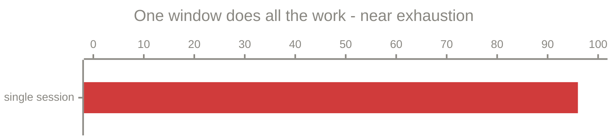
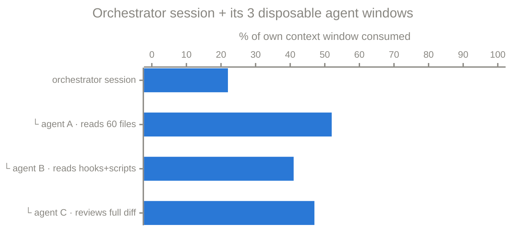
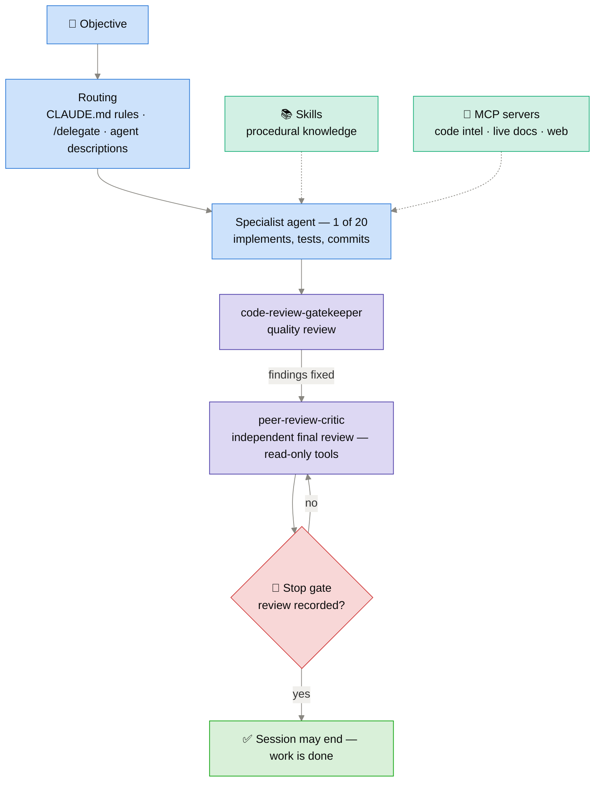
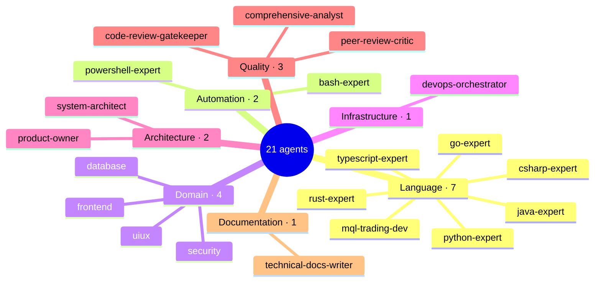
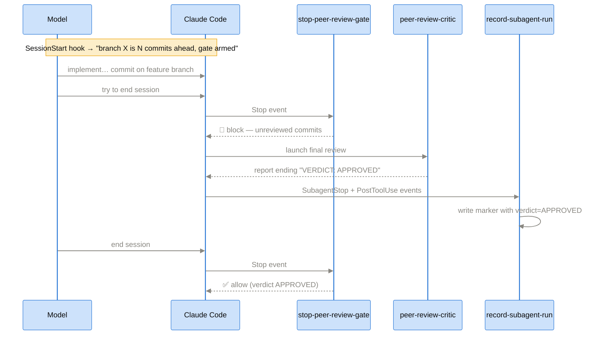
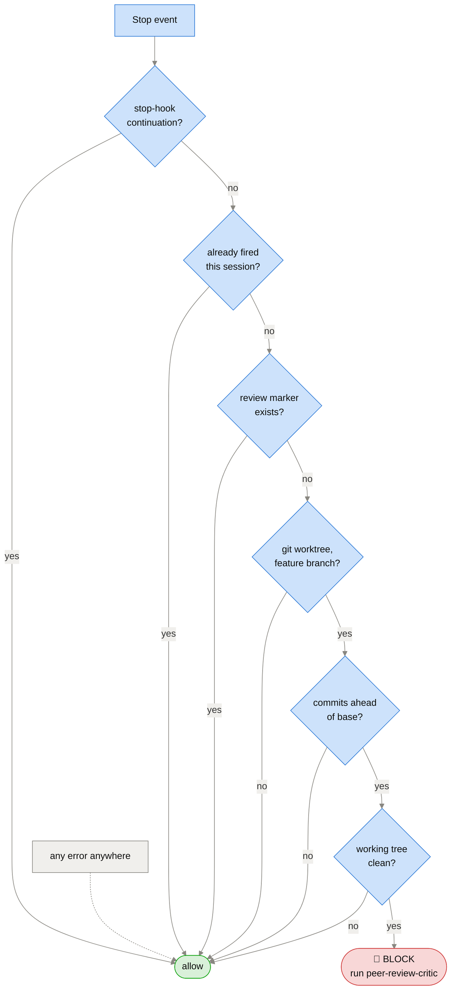
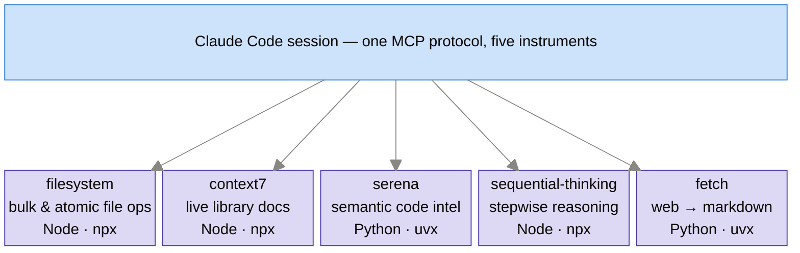
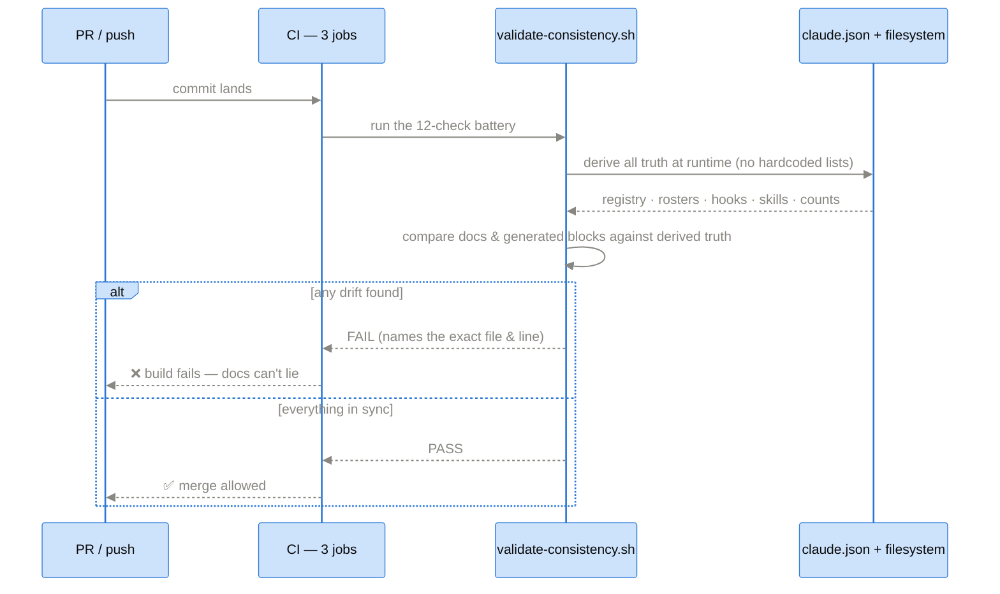

# Claude Agentic Framework

*A configuration framework that turns Claude Code CLI into a disciplined, 21-agent engineering team — with real, tested enforcement.*

---

## 1. Agentic vs. Chatbot

| | Chatbot | Agent |
|---|---|---|
| Interaction | One question → one answer | One **goal** → a finished **outcome** |
| Who executes | You (copy/paste, run, verify) | The agent (edits files, runs commands, reads results) |
| **Context** | Only what you paste; lost when the window overflows | Gathers its own: reads the repo, greps code, checks git history, fetches live docs |
| Memory & state | Forgets everything between chats | Persistent: project rules (`CLAUDE.md`), memory files, session state |
| Tool use | None (text in, text out) | Full toolbelt: filesystem, shell, git, web, MCP servers |
| Planning | Single-shot best guess | Decomposes the goal, tracks tasks, replans when a step fails |
| Feedback loop | None — it can't see what happened | Observes tool output, self-corrects, iterates |
| Autonomy | Human drives every step | Works unattended for minutes to hours; escalates only real decisions |
| Verification | You must check every claim | Runs the tests, validators, and review agents itself |
| Collaboration | One generalist model | A routed team of specialists + independent reviewers |
| Guardrails | Content filtering only | Permissions, hooks, and blocking quality gates |
| Failure mode | Confidently wrong text | Caught by tests, CI, and the review chain before it ships |



### Context economics — the invisible difference

A model's context window is finite. *Where the tokens burn* is the real architectural difference — same task, measured as % of each context window consumed:

**Panel 1 — non-agentic: one session carries everything.** Every pasted file, build log, and diff accumulates in the single window until early decisions fall out of memory:



**Panel 2 — agentic: the orchestrating session stays lean.** The main bar is the orchestrator's window; the sub-bars (└) are its three *disposable* child windows, which do the heavy reading and return only distilled summaries:



Same task, opposite failure modes: the single session hits the ceiling and *degrades*; the orchestrator's window (green) grows only by summaries, while the heavy tokens burn in child windows (orange) that are thrown away afterwards. **Real numbers from this repo's own overhaul:** the two review agents alone consumed ~357k tokens inside their own windows — the coordinating session received two reports of ~1,500 tokens each.

---

## 2. Architecture — one objective, end to end



**Proof it works:** the framework was recently overhauled through its own pipeline — a multi-agent audit found the gaps, 10 commits fixed them, both review agents signed off, 3 CI jobs passed, and the Stop gate enforced the final review live (PR #20).

---

## 3. Components

### 3.1 Agents — the workforce (21)

An agent = a markdown file: YAML frontmatter (name, routing description, model tier, tools) + a system prompt. **Routing is description-driven** — the task text is matched against agent descriptions, so a well-written description *is* the router.



- **Model tiers scale with stakes**: `opus` = architecture & final review · `sonnet` = implementation · `haiku` = scripting & docs.
- **peer-review-critic has a deliberately read-only toolset** — the final reviewer *cannot* modify the code it reviews. Independence enforced by tool access, not by asking nicely.
- Agents have full tool access in their domain and can invoke each other for cross-domain work.

### 3.2 Commands — the operations console (9)

| Command | Role |
|---|---|
| `/delegate` | Route an objective end-to-end through specialists |
| `/list-agents` | Roster with categories, model tiers, status |
| `/agent-status` | Per-agent configuration health |
| `/analyze-framework` | Full health check (runs the real validators) |
| `/quality-report` | Quality assessment from actual config state |
| `/validate-hooks` | Hook registration parity check |

### 3.3 Hooks — the enforcement layer (4)

The only component that can **say no**: PowerShell 7 scripts registered on Claude Code lifecycle events, receiving event JSON on stdin.

| Hook | Event | Guards |
|---|---|---|
| `stop-peer-review-gate` | `Stop` | **The one hard gate** — no session ends with committed, unreviewed work |
| `record-subagent-run` | `PostToolUse` + `SubagentStop` | Records peer-review-critic runs and parses the review's `VERDICT:` line — `APPROVED` is what unlocks the gate |
| `session-start-context` | `SessionStart` | Injects branch + review status into context at startup |
| `pretooluse-delegation-hint` | `PreToolUse` | Suggests the matching specialist when a `.rs`/`.py`/`.cs`/… file is written |

The gate's lifecycle:



Its decision logic — every "no" answer allows the stop (**fail-open**):



Design philosophy: **one hard gate at the single choke point** (all work becomes committed code) · everything else advisory · fail-open everywhere · bounded blocking — once when no review ran, up to 3 while the verdict is `CHANGES_REQUIRED`: a gate, not a nag. Behavior pinned by 44 test assertions; CI fails if a script and its registration ever drift apart.

*Field note: minutes after installation, the gate blocked its own author's session — for having unreviewed commits. It was reviewing the commits that created it.*

### 3.4 Skills — procedural knowledge (9)

Loaded on demand when a task matches. An agent is *someone to delegate to*; a skill is *knowledge the current agent absorbs*.

| Skill | Teaches Claude how to… |
|---|---|
| agent-debugger | Diagnose routing/loading/config failures |
| agent-routing-advisor | Pick the right agent or agent sequence |
| code-scaffolder | Bootstrap idiomatic projects per language |
| code-scoring-loop | Score a code diff via the specialist agents, rewrite the weakest parts, rescore until it plateaus — before, never instead of, the review gates |
| dependency-checker | Verify the toolchain (git, jq, pwsh 7, node, uv) |
| git-workflow-assistant | Branch/commit/PR flow, incl. working *with* the Stop gate |
| hook-config-generator | Add a new real hook (script → registration → tests) |
| refactoring-advisor | Spot code smells, prioritize refactorings |
| self-scoring-loop | Rubric-score a non-code deliverable, rewrite the weakest parts, rescore until it plateaus |

### 3.5 MCP servers — senses and instruments (5)

MCP (Model Context Protocol) = the open standard for plugging external tools into the model.



`context7` beats training-data recall with current docs; `serena` gives LSP-grade navigation instead of text grep; `sequential-thinking` scaffolds explicit reasoning chains for hard problems; `fetch` turns web pages into clean markdown.

### 3.6 Anti-drift consistency system — the immune system

In config-as-code, docs and reality drift apart silently. Here, drift **fails the build**:



- Nothing is hardcoded: registry↔filesystem parity, category partition, hook registration parity, model parity, roster presence, stated-count scanning — all derived.
- Headline numbers in the README are **generated blocks** — the docs physically cannot lie about counts.
- A 34-assertion harness injects defects into throwaway repo copies and proves the validator catches each class.

---

## 4. Getting started

```bash
git clone <repo> ~/.claude
pwsh -NoProfile -File ~/.claude/scripts/install.ps1   # settings + hooks + state dir
bash ~/.claude/scripts/validate-consistency.sh        # expect: RESULT: PASS
```

Prereqs: Claude Code CLI, git, PowerShell 7+, bash + jq; Node/npx and uv for the MCP servers.

---

## 5. By the numbers

| | |
|---|---|
| Specialized agents | 21 (7 categories, 3 model tiers) |
| Hooks | 4 registered — 1 blocking gate, 3 advisory |
| Skills | 9 loadable knowledge modules |
| Commands | 9 management commands |
| MCP servers | 5 (filesystem, context7, serena, sequential-thinking, fetch) |
| Validator checks | 12, all derived at runtime |
| Test assertions | 34 (consistency) + 44 (hook behavior) |
| CI jobs | 3, including a Windows leg |

**Takeaway:** agents write the code · hooks make quality non-negotiable · the consistency system keeps the whole thing honest.
