# Multi-Agent Workflow Visualizer Skill

## Purpose

Create visual representations of agent workflows, coordination patterns, and quality gate sequences using Mermaid diagrams. Helps understand complex multi-agent interactions and document workflow patterns.

## When to Use

- Understanding complex multi-agent workflows
- Documenting agent coordination patterns
- Planning new feature implementations
- Training team members on agent ecosystem
- Visualizing quality gate dependencies
- Architecture documentation

## Diagram Types

### 1. Agent Workflow Diagram


### 2. Multi-Agent Coordination


### 3. Quality Gate Flow

```mermaid
flowchart TD
    Start([Code Change]) --> Compile{Compilation}
    Compile -->|Success| Lint{Linting}
    Compile -->|Fail| CompileFix[comprehensive-analyst fixes]
    CompileFix --> Compile

    Lint -->|Success| Tests{Tests}
    Lint -->|Fail| LintFix[Auto-fix or manual]
    LintFix --> Lint

    Tests -->|Success| Coverage{Coverage}
    Tests -->|Fail| TestFix[Fix tests]
    TestFix --> Tests

    Coverage -->|≥80%| Security{Security}
    Coverage -->|<80%| CoverageFix[Add tests]
    CoverageFix --> Coverage

    Security -->|Pass| Deploy[Deploy]
    Security -->|Fail| SecurityFix[security-specialist fixes]
    SecurityFix --> Security

    Deploy --> End([Success])

    style Start fill:#e1f5e1
    style End fill:#e1f5e1
    style Deploy fill:#c8e6c9
    style CompileFix fill:#ffcdd2
    style LintFix fill:#ffcdd2
    style TestFix fill:#ffcdd2
    style CoverageFix fill:#ffcdd2
    style SecurityFix fill:#ffcdd2
```



### 4. Agent Capability Map


## Workflow Templates

### Template 1: Feature Development Workflow

```yaml
workflow_name: "Feature Development"
pattern: "requirements → architecture → implementation → validation → documentation"

agents:
  - name: "product-owner"
    role: "Define requirements"
    output: "User stories with acceptance criteria"

  - name: "system-architect"
    role: "Design architecture"
    input_from: "product-owner"
    output: "Technical specification"

  - name: "implementation-expert"
    role: "Implement feature"
    input_from: "system-architect"
    variants: ["rust-expert", "java-expert", "python-expert", etc.]
    output: "Working code with tests"

  - name: "code-review-gatekeeper"
    role: "Validate quality"
    input_from: "implementation-expert"
    output: "Quality approval"

  - name: "technical-docs-writer"
    role: "Document feature"
    input_from: "code-review-gatekeeper"
    output: "Documentation"

mermaid_diagram: |
  graph TB
    PO[product-owner<br/>Requirements] --> SA[system-architect<br/>Architecture]
    SA --> IE[implementation-expert<br/>Code + Tests]
    IE --> CRG[code-review-gatekeeper<br/>Quality Gates]
    CRG --> TDW[technical-docs-writer<br/>Documentation]

    style PO fill:#fff4e6
    style SA fill:#e3f2fd
    style IE fill:#f3e5f5
    style CRG fill:#fce4ec
    style TDW fill:#e0f2f1
```

### Template 2: Security-Critical Feature

```yaml
workflow_name: "Security-Critical Implementation"
pattern: "security design → implementation → security audit → validation"

agents:
  - name: "security-specialist"
    role: "Define security requirements"
    output: "Security specification"

  - name: "implementation-expert"
    role: "Secure implementation"
    input_from: "security-specialist"
    output: "Security-hardened code"

  - name: "security-specialist"
    role: "Security audit"
    input_from: "implementation-expert"
    output: "Security validation"

  - name: "code-review-gatekeeper"
    role: "Final quality gates"
    input_from: "security-specialist"
    output: "Deployment approval"

mermaid_diagram: |
  sequenceDiagram
    participant SS1 as security-specialist
    participant IE as implementation-expert
    participant SS2 as security-specialist
    participant CRG as code-review-gatekeeper

    SS1->>SS1: Define security requirements
    SS1->>IE: Security specification
    IE->>IE: Implement security controls
    IE->>SS2: Request security audit
    SS2->>SS2: Penetration testing
    SS2->>CRG: Security validated
    CRG->>CRG: Final quality gates
    CRG-->>User: Deployment approved
```

### Template 3: Performance Optimization

```yaml
workflow_name: "Performance Optimization"
pattern: "analyze → optimize → validate"

agents:
  - name: "comprehensive-analyst"
    role: "Profile and identify bottlenecks"
    output: "Performance analysis"

  - name: "implementation-expert"
    role: "Implement optimizations"
    input_from: "comprehensive-analyst"
    output: "Optimized code"

  - name: "comprehensive-analyst"
    role: "Validate improvements"
    input_from: "implementation-expert"
    output: "Performance comparison"

mermaid_diagram: |
  graph LR
    CA1[comprehensive-analyst<br/>Profile] --> IE[implementation-expert<br/>Optimize]
    IE --> CA2[comprehensive-analyst<br/>Validate]

    CA1 -.->|Bottleneck Report| IE
    IE -.->|Optimized Code| CA2
    CA2 -.->|Performance Metrics| End([Success])

    style CA1 fill:#e3f2fd
    style IE fill:#f3e5f5
    style CA2 fill:#e3f2fd
    style End fill:#c8e6c9
```

## Visualization Functions

### Generate Workflow Diagram

```typescript
interface WorkflowVisualization {
  title: string;
  agents: Agent[];
  connections: Connection[];
  diagram_type: "graph" | "sequence" | "flowchart" | "mindmap";
}

function generateWorkflowDiagram(workflow: Workflow): string {
  const mermaid = `
    graph TB
    ${workflow.agents.map((agent, index) =>
      `A${index}[${agent.name}<br/>${agent.role}]`
    ).join('\n    ')}

    ${workflow.connections.map(conn =>
      `A${conn.from} -->|${conn.label}| A${conn.to}`
    ).join('\n    ')}

    ${workflow.agents.map((agent, index) =>
      `style A${index} fill:${getAgentColor(agent.category)}`
    ).join('\n    ')}
  `;

  return mermaid;
}
```

### Generate Quality Gate Flow

```typescript
function generateQualityGateFlow(gates: QualityGate[]): string {
  const mermaid = `
    flowchart TD
    Start([Code Change])

    ${gates.map((gate, index) => `
      ${gate.name}{${gate.description}}
      ${gate.on_success} -->|Success| Next${index}
      ${gate.on_failure} -->|Fail| Fix${index}[${gate.fix_agent}]
      Fix${index} --> ${gate.name}
    `).join('\n')}

    End([Deploy])
  `;

  return mermaid;
}
```

### Generate Agent Coordination

```typescript
function generateCoordinationDiagram(task: ComplexTask): string {
  const mermaid = `
    sequenceDiagram
    participant User
    ${task.agents.map(agent =>
      `participant ${agent.id} as ${agent.name}`
    ).join('\n    ')}

    ${task.interactions.map(interaction =>
      `${interaction.from}->>+${interaction.to}: ${interaction.message}
       ${interaction.to}-->>-${interaction.from}: ${interaction.response}`
    ).join('\n    ')}
  `;

  return mermaid;
}
```

## Color Coding

```yaml
agent_categories:
  requirements:
    agents: ["product-owner"]
    color: "#fff4e6"  # Warm amber

  architecture:
    agents: ["system-architect"]
    color: "#e3f2fd"  # Light blue

  implementation:
    agents: ["rust-expert", "java-expert", "python-expert", etc.]
    color: "#f3e5f5"  # Light purple

  quality:
    agents: ["code-review-gatekeeper", "comprehensive-analyst"]
    color: "#fce4ec"  # Light pink

  documentation:
    agents: ["technical-docs-writer"]
    color: "#e0f2f1"  # Light teal

  infrastructure:
    agents: ["devops-orchestrator"]
    color: "#f1f8e9"  # Light green

  specialists:
    agents: ["database-specialist", "security-specialist", "frontend-specialist", "uiux-specialist"]
    color: "#fff9c4"  # Light yellow
```

## Usage Examples

### Example 1: Visualize Feature Development

```bash
User: "Show me the workflow for building a new REST API feature"

Workflow Visualizer Response:

📊 Generating workflow diagram for REST API feature...


📋 Workflow Steps:
1. product-owner: Define API requirements and user stories
2. system-architect: Design API architecture and endpoints
3. database-specialist: Design database schema
4. backend-expert: Implement API (choose: rust-expert, java-expert, python-expert, etc.)
5. security-specialist: Security audit and validation
6. code-review-gatekeeper: Quality gates and test validation
7. technical-docs-writer: API documentation (OpenAPI/Swagger)

⏱️ Estimated Time: 4-6 hours
```

### Example 2: Quality Gate Visualization

```bash
User: "Show me the quality gate flow"

Workflow Visualizer Response:

📊 Generating quality gate flow diagram...

```mermaid
flowchart TD
    Start([Code Change]) --> Compile{Compilation<br/>cargo build}
    Compile -->|✓| Lint{Linting<br/>cargo clippy}
    Compile -->|✗| CA1[comprehensive-analyst]
    CA1 --> Compile

    Lint -->|✓| Tests{Tests<br/>cargo test}
    Lint -->|✗| AutoFix[Auto-fix]
    AutoFix --> Lint

    Tests -->|✓| Coverage{Coverage<br/>≥80%?}
    Tests -->|✗| FixTests[Fix failing tests]
    FixTests --> Tests

    Coverage -->|✓| Security{Security<br/>cargo audit}
    Coverage -->|✗| AddTests[Add missing tests]
    AddTests --> Coverage

    Security -->|✓| Deploy[✓ Ready to Deploy]
    Security -->|✗| SS[security-specialist]
    SS --> Security

    style Start fill:#e1f5e1
    style Deploy fill:#c8e6c9
    style CA1 fill:#ffcdd2
    style AutoFix fill:#fff9c4
    style FixTests fill:#ffcdd2
    style AddTests fill:#ffcdd2
    style SS fill:#ffcdd2
```



🚦 Quality Gates:
- ✅ Compilation: Zero errors
- ✅ Linting: Zero warnings
- ✅ Tests: 100% passing
- ✅ Coverage: ≥80%
- ✅ Security: No vulnerabilities
```

### Example 3: Agent Capability Overview

```bash
User: "Show me all agents and their domains"

Workflow Visualizer Response:

📊 Generating agent capability map...


🎯 Total: 18 Specialized Agents
📂 Categories: 6 major categories
🔧 Coverage: Complete SDLC coverage
```

## Export Formats

```yaml
export_options:
  mermaid:
    format: "markdown"
    extension: ".md"
    live_editor: "https://mermaid.live"

  png:
    format: "image"
    extension: ".png"
    renderer: "mermaid-cli"
    command: "mmdc -i workflow.mmd -o workflow.png"

  svg:
    format: "vector"
    extension: ".svg"
    renderer: "mermaid-cli"
    command: "mmdc -i workflow.mmd -o workflow.svg"

  pdf:
    format: "document"
    extension: ".pdf"
    renderer: "mermaid-cli + puppeteer"
```

## Integration

Coordinates with:
- `agent-routing-advisor` - Visualizes recommended workflows
- `framework-validator` - Diagrams framework structure
- Documentation generation - Creates visual documentation

## Success Criteria

- ✅ Clear visual representation
- ✅ Accurate agent relationships
- ✅ Proper color coding
- ✅ Readable layout
- ✅ Exportable formats
- ✅ Up-to-date with agent structure
